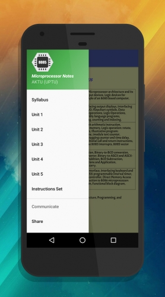

# Microprocessor 8085 - Android Notes App
 
<a href="https://play.google.com/store/apps/details?id=com.notes.microprocessor_aktu"></a>

## To use source code : 
1. Clone Repository <br>
```git clone https://github.com/ft-abhishekgupta/android-microprocessor-notes-app```
1. Open Repository in Android Studio
1. Sync Project and Install Required Dependencies
1. Build and Run Project.

## About App :
 

8085 Microprocessor AKTU is a free Application that covers the AKTU Syllabus of Introduction to Microprocessor. The efforts are made to cover each and every topic in the syllabus at the same time keeping in mind to make the text as concise and accurate as possible.

The application contains unit wise discussion of the subject. The instructions of 8085 along with their functions and other specifications are separated out from the rest of the discussion. This helps the reader for last minute revision of all the instructions quickly.

### The application includes :
1. Syllabus (AKTU)
1. Unit 1
1. Unit 2
1. Unit 3
1. Unit 4
1. Unit 5
1. Instruction Set

### Features of the Application:
* Simple Layout
* Easy Navigation from one section to another
* All the 8085 instructions are discussed separately under the section "Instruction Set"
* Easy and neat Diagrams are used to make the concept more clear.
* Easy to read and understandable font is used
* To the point explanation of topics
* Handy for quick revision

**Do rate and share if you like the app.**
## Screenshots


